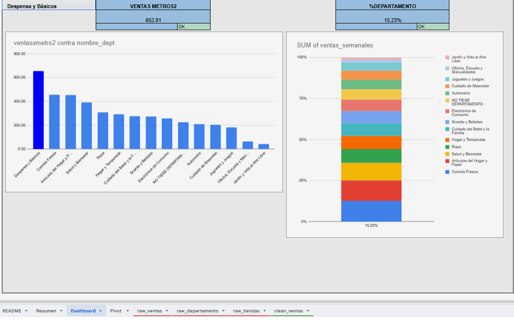
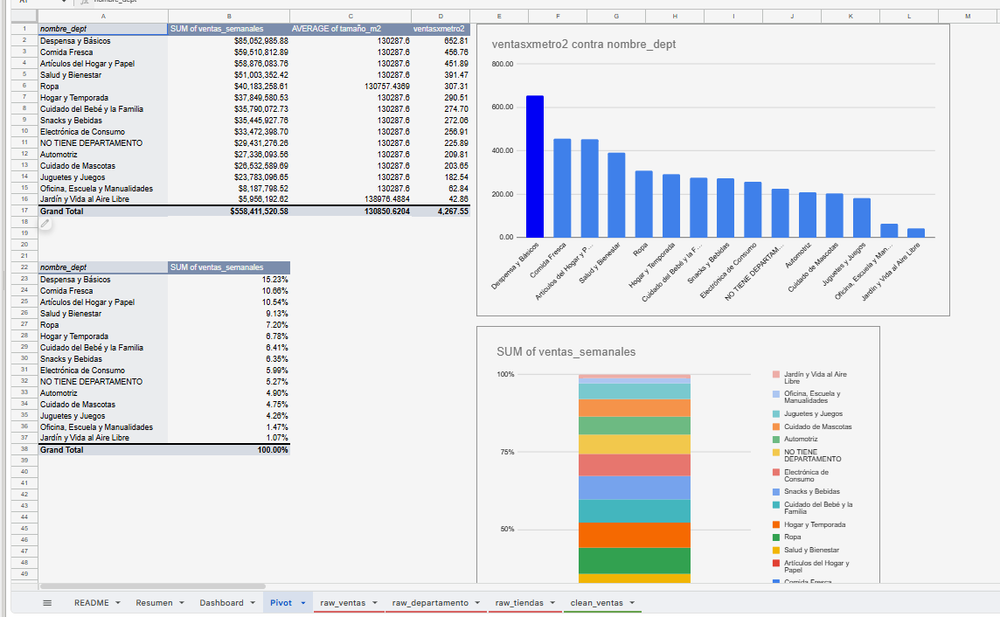
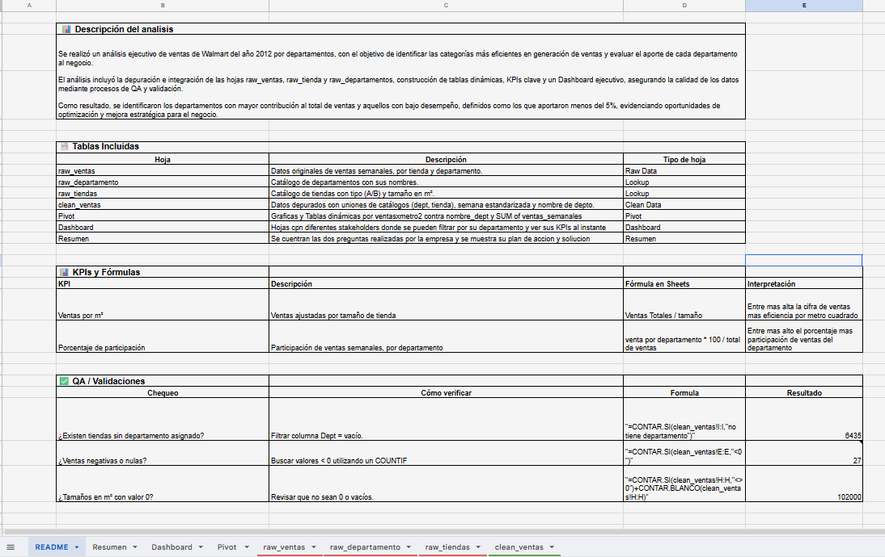

# Análisis de Ventas y Limpieza de Datos – Google Sheets

## Objetivo / Pregunta de negocio
¿Qué departamentos de un almacén de Internet generan más ventas por metro cuadrado y cuáles necesitan más inversión en publicidad? Se buscó identificar las categorías más eficientes y evaluar el aporte de cada departamento al negocio.

Proyecto desarrollado como parte del programa de Analista de Datos de TripleTen.

## Datos
Dataset de ventas semanales de un almacén de Internet, año 2021:

| Tabla | Descripción |
|---|---|
| `raw_ventas` | Registro de ventas semanales por tienda y departamento |
| `raw_departamentos` | Catálogo de departamentos del almacén |
| `raw_tiendas` | Información de tiendas |
| `clean_ventas` | Datos limpios listos para el análisis |

## Proceso
1. **Limpieza y preparación:** identificación y tratamiento de nulos e inconsistencias, estandarización de fechas y valores numéricos, validación de duplicados.
2. **Integración de tablas:** cruce de tablas mediante referencias entre hojas para construir una tabla maestra.
3. **Cálculo de KPIs:** ventas por metro cuadrado por departamento, participación porcentual de ventas, comparación de rendimiento entre departamentos.
4. **Tablas dinámicas:** ventas semanales por departamento, ranking por volumen de ventas, participación porcentual por categoría.
5. **Dashboard:** gráfico de barras (ventas por departamento), gráfico de torta (distribución porcentual), filtros interactivos.

## Entregable
Dashboard interactivo en Google Sheets (ver capturas abajo).

## Insights
- **Despensa y Básicos** fue el departamento con mayor volumen de ventas: **$652.81** en ventas por metro cuadrado.
- **Despensa y Básicos** representó el **15.23%** del total de ventas por departamento.
- Los departamentos con participación por debajo del promedio representan una oportunidad de mejora en publicidad y reposición de inventario.
- **Jardín y Vida al Aire Libre** y **Artículos del Hogar** se posicionaron como departamentos de alto potencial de crecimiento.

## Recomendación / Siguiente paso
Si este fuera un caso real, recomendaría reasignar parte del presupuesto de publicidad hacia Jardín y Vida al Aire Libre y Artículos del Hogar, dado su potencial de crecimiento identificado pero baja participación actual. Como siguiente paso, mediría el impacto de esa reasignación comparando ventas por metro cuadrado antes/después a los 3 meses.

## Preguntas de Negocio Respondidas

| Pregunta | KPI |
|---|---|
| ¿Qué categorías generan más ventas por metro cuadrado? | Ventas por metro² |
| ¿Qué departamentos necesitan mayor inversión en publicidad? | Participación % por departamento |

## Cómo ejecutar
Requisitos: cuenta de Google (Google Sheets). Abrir el archivo de Sheets vinculado al repositorio; las hojas `raw_*` contienen los datos originales y `Dashboard` el tablero final.

## Herramientas utilizadas
Google Sheets, Tablas Dinámicas (Pivot Tables), Limpieza de Datos, KPI Analysis, Dashboard/Visualización

## Vista General del Proyecto

## Autor
**Stiven Lizarazo** — Junior Data Analyst
Proyecto desarrollado como parte del programa de Análisis de Datos de TripleTen.
[LinkedIn](https://www.linkedin.com/in/stiven-lizarazo-4b5177258/) · lizarazostiven36@gmail.com
