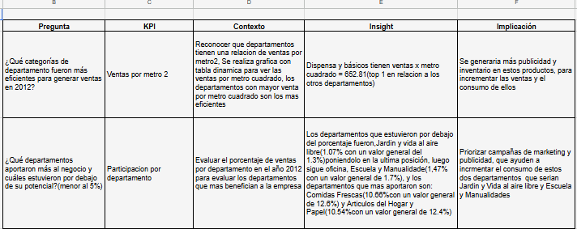

# Análisis de Ventas y Limpieza de Datos – Google Sheets

## Descripción del Proyecto

Se analizó un dataset de ventas de un almacén de Internet del año 2021 con el objetivo de identificar las categorías más eficientes en generación de ventas y evaluar el aporte de cada departamento al negocio.

Este análisis fue desarrollado como parte del programa de **Analista de Datos de TripleTen**.

---

## Objetivo

Analizar datos de ventas para identificar los departamentos con mayor contribución al negocio y detectar patrones relevantes en el comportamiento de las ventas semanales por departamento.

---

## Dataset

| Tabla | Descripción |
|---|---|
| `raw_ventas` | Registro de ventas semanales por tienda y departamento |
| `raw_departamentos` | Catálogo de departamentos del almacén |
| `raw_tiendas` | Información de tiendas |
| `clean_ventas` | Datos limpios listos para el análisis |

---

## Proceso de Análisis

### 1. Limpieza y preparación de datos
- Identificación y tratamiento de valores nulos e inconsistencias
- Estandarización de formatos en fechas y valores numéricos
- Validación de registros duplicados

### 2. Integración de tablas
- Cruce de tablas usando referencias entre hojas
- Construcción de una tabla maestra para el análisis

### 3. Cálculo de KPIs de negocio
- Ventas por metro cuadrado por departamento
- Participación porcentual de ventas por departamento
- Comparación de rendimiento entre departamentos

### 4. Tablas dinámicas
- Ventas semanales por departamento
- Ranking de departamentos por volumen de ventas
- Participación porcentual de cada categoría

### 5. Tablero de visualización (Dashboard)
- Gráfico de barras: ventas por departamento
- Gráfico de torta: distribución porcentual de ventas
- Filtros interactivos por departamento

---

## Principales Hallazgos

- 🏆 **Despensa y Básicos** fue el departamento con mayor volumen de ventas con **$652.81** en ventas por metro cuadrado.
- 📊 **Despensa y Básicos** representó el **15.23%** del total de ventas por departamento.
- 📉 Los departamentos con participación por debajo del promedio representan una oportunidad de mejora en publicidad y reposición de inventario.
- 💡 **Jardín y Vida al Aire Libre** y **Artículos del Hogar** se posicionaron como departamentos de alto potencial de crecimiento.

---

## Preguntas de Negocio Respondidas

| Pregunta | KPI |
|---|---|
| ¿Qué categorías generan más ventas por metro cuadrado? | Ventas por metro 2 |
| ¿Qué departamentos necesitan mayor inversión en publicidad? | Participación % por departamento |

---

## Estructura del Proyecto

```
analisis-ventas-google-sheets/
│
├── README.md
└── Dashboard (Google Sheets)
    ├── Hoja: raw_ventas
    ├── Hoja: raw_departamentos
    ├── Hoja: raw_tiendas
    ├── Hoja: clean_ventas
    ├── Hoja: Pivot (Tablas dinámicas)
    ├── Hoja: Dashboard
    └── Hoja: Resumen del análisis
```

---

## Herramientas Utilizadas

- Google Sheets
- Tablas Dinámicas (Pivot Tables)
- Limpieza de Datos (Data Cleaning)
- KPI Analysis
- Dashboard / Visualización

---
## Vista del Proyecto

## Vista del Proyecto

### Dashboard


### Tablas Dinámicas


### Resumen del Análisis


## Autor

**Stiven Lizarazo**  
Analista de Datos Junior  
Proyecto desarrollado como parte del programa de Análisis de Datos de TripleTen.
